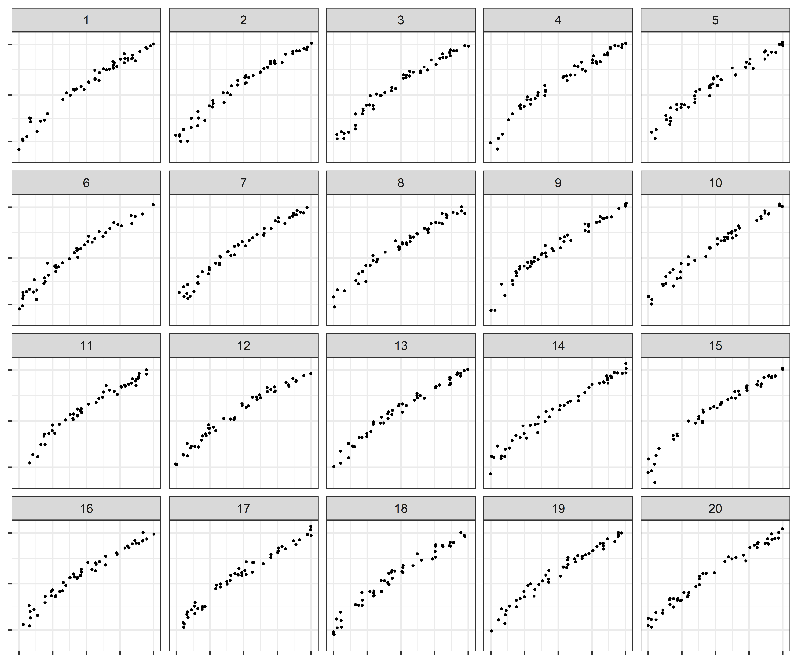

# Experiment Name

+ Conducted: 2020-09-17 to 2020-10-25

+ Platform: Shiny app

+ Recruitment Method: Graphics group and presentations

+ Lineup Type(s): Rorschach, One-target


## Plot Generation

See `app/code/lineup_generation.R`.



### Parameters

#### Model

Three parameter exponential with a multiplicative error.

$$y_i = \alpha e^{\beta x_i + \epsilon_i} + \theta $$

#### Heuristic Simulation Approach

1. Set 4 points (Min, Max, Midpoint - 2 of these for convergence)
2. Select starting values
  - Obtain linear model coefficients for $\log(y_i) = a+bx_i$
	- $\alpha_0 = e^a$
	- $\beta_0 = b$
	- $\theta_0 = \frac{\min(y)}{2}$
3. Using `nls()`, fit selected model to the points and obtain parameter estimates.
$$y_i = \hat\alpha e^{\hat\beta x_i} + \hat\theta$$
4. Using the parameter estimates, assume $\epsilon_i \sim N(0, \sigma^2)$ and set $\tilde \alpha = \frac{\hat\alpha}{e^{\sigma^2/2}}$. Simulate data based on $y_i = \tilde\alpha e^{\hat\beta x_i + \epsilon_i}+\hat\theta.$

#### Simulations conducted

The **Lack of Fit** test statistic calculated by the deviation of the data from a linear regression line was used to determine the curvature and variability combination values.

**Curvature**
- Controled by the `Midpoint` in the heuristic simulation and in turn affects $\hat\beta.$
- Easy / Medium / Hard

**Variability**
- Controled by the standard deviation, $\sigma$, of the errors.
- Low / High

```{r echo=F, message=FALSE, warning=FALSE, parameterselection, eval=T}
library(tidyverse)
library(lme4)

xMid_vals  <- c(14.5, 13, 11.5)
sigma_vals <- c(0.25, 0.37, 0.12, 0.18, 0.05, 0.07)

yRange_vals = c(10,100)

coefEst <- function(xMid, xRange = c(0,20), yRange = yRange_vals){
  
  # This creates the line y = -x (scaled to fit the x and y ranges)
  # |*            0
  # |  *
  # |    *
  # |      *
  # |        1
  # |          2
  # |0___________3
  #
  # where 1, 2, 3 represent different points used to determine the line curvature
  
  lineData   <- tibble(xLine = seq(xRange[1],xRange[2],0.1),
                       yLine = -(abs(diff(yRange))/abs(diff(xRange)))*(xLine-xRange[1])+yRange[2])
  pointsData <- tibble(xPoint = c(xRange[1], (xMid-0.1), (xMid+0.1), xRange[2]),
                       yPoint = c(yRange[1], lineData$yLine[lineData$xLine == xMid], lineData$yLine[lineData$xLine == xMid], yRange[2]))
  
  # Connecting the 0 points in the illustration above with the 3rd point that
  # determines curvature gives us a set of 3 points to use to fit an exponential
  # line to the data.
  
  # We fit a linear regression to the log-transformed data to get starting values
  lm.fit <- lm(log(yPoint) ~ xPoint, data = pointsData)
  
  alpha.0  <- exp(coef(lm.fit)[1]) %>% as.numeric()
  beta.0   <- coef(lm.fit)[2] %>% as.numeric()
  theta.0 <- min(pointsData$yPoint) * 0.5  # Why 0.5?
  
  # and then use NLS to fit a better line to the data
  start <- list(alpha = alpha.0, beta = beta.0, theta = theta.0)
  nonlinear.fit   <- nls(yPoint ~ alpha * exp(beta * xPoint) + theta ,
                         data = pointsData, start = start)
  
  coefficients <- tibble(alphahat = (coef(nonlinear.fit)[1] %>% as.numeric()),
                         betahat  = coef(nonlinear.fit)[2] %>% as.numeric(),
                         thetahat = coef(nonlinear.fit)[3] %>% as.numeric())
  
  return(coefficients)
}


coefData <- tibble(xMid = xMid_vals) %>%
  mutate(coefficients = pmap(list(xMid),coefEst)) %>%
  unnest(coefficients)

#Identify parameters
parmData <- tibble(Curvature   = c("Easy", "Easy", "Medium", "Medium", "Hard", "Hard"),
                   Variability = c("Low", "High", "Low", "High", "Low", "High"),
                   xMid        = c(rep(xMid_vals[1],2), rep(xMid_vals[2],2), rep(xMid_vals[3],2)),
                   sigma       = sigma_vals) %>%
  left_join(coefData, by = "xMid")

knitr::kable(parmData, 'html', digits = 3)
```

```{r parameterselection2, eval=T, echo = F}
options(knitr.kable.NA = '')
knitr::kable(rbind(Domain = c(0,20),
             Range = c(10,100),
             N = c(50, NA)), "html")
```

### Geoms

All plots in this experiment are scatterplots. 


## Experimental Design:

See randomization folder in `app/code/randomization.R`.

### Treatment Design 

Target Panel gets model A and Null Panels get model B

3!2!= 6 panel comboinations of curvature x 2 levels of variability = 12

2!1!= 2 panel combinations of variability x 3 levels of curvature =6

= 18 test parameter combinations

3 x 2 = 6 rorschach parameter combinations

= 24 parameter combinations

x 2 lineup datasets per parameter combination 

= **48 datasets**

x 2 scales (log & linear) 

= **96 different lineups.**


### Experimental Design:

Split plot with an IBD for the whole plot factor

9 test parameter combinations per participant x 2 scales = 18 test lineups

1 rorschach parameter combination per participant x 2 scales = 2 rorschach lineups

= **20 lineup plots per participant**

## Data Files

Data file and field descriptions can be found in `data/data-manifest.md`

Emily, the columns need descriptions in data-manifest.md, but everything should be well structured at least :). You should be able to copy paste once you set things up 

## Results: 

+ [Github Repo](https://github.com/srvanderplas/Perception-of-Log-Scales)

+ Presentations: [Graphics Group 2020-09-17](https://srvanderplas.github.io/Perception-of-Log-Scales/presentations/graphics-group/sept_17_2020/index.html#1); [UNL Ph.D. Seminar 2020-10-08](https://srvanderplas.github.io/Perception-of-Log-Scales/presentations/eskridge-PhD-seminars/oct_8_2020/index.html#1)

+ Manuscripts: [JSM 2021 Student Paper (Section on Statistical Graphics)](https://github.com/srvanderplas/Perception-of-Log-Scales/blob/master/manuscripts/jsm-2021-student-paper-submission/jsm-2021-student-paper-submission.pdf)
