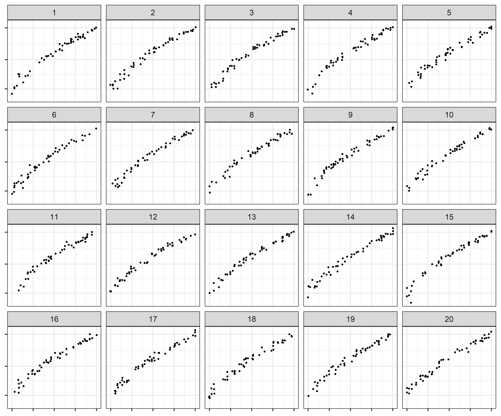

Pilot: Log Scales
================
Emily Robinson, Reka Howard, Susan Vanderplas

# Experiment Name

  - Conducted: 2020-09-17 to 2020-10-25

  - Platform: Shiny app

  - Recruitment Method: Graphics group and presentations

  - Lineup Type(s): Rorschach, One-target

## Plot Generation

See `app/code/lineup_generation.R`.

### Parameters

#### Model

Three parameter exponential with a multiplicative error.

\[y_i = \alpha e^{\beta x_i + \epsilon_i} + \theta \]

#### Heuristic Simulation Approach

1.  Set 4 points (Min, Max, Midpoint - 2 of these for convergence)
2.  Select starting values

<!-- end list -->

  - Obtain linear model coefficients for \(\log(y_i) = a+bx_i\)
      - \(\alpha_0 = e^a\)
      - \(\beta_0 = b\)
      - \(\theta_0 = \frac{\min(y)}{2}\)

<!-- end list -->

3.  Using `nls()`, fit selected model to the points and obtain parameter
    estimates. \[y_i = \hat\alpha e^{\hat\beta x_i} + \hat\theta\]
4.  Using the parameter estimates, assume
    \(\epsilon_i \sim N(0, \sigma^2)\) and set
    \(\tilde \alpha = \frac{\hat\alpha}{e^{\sigma^2/2}}\). Simulate data
    based on
    \(y_i = \tilde\alpha e^{\hat\beta x_i + \epsilon_i}+\hat\theta.\)

#### Simulations conducted

The **Lack of Fit** test statistic calculated by the deviation of the
data from a linear regression line was used to determine the curvature
and variability combination values.

**Curvature** - Controled by the `Midpoint` in the heuristic simulation
and in turn affects \(\hat\beta.\) - Easy / Medium / Hard

**Variability** - Controled by the standard deviation, \(\sigma\), of
the errors. - Low / High

<table>

<thead>

<tr>

<th style="text-align:left;">

Curvature

</th>

<th style="text-align:left;">

Variability

</th>

<th style="text-align:right;">

xMid

</th>

<th style="text-align:right;">

sigma

</th>

<th style="text-align:right;">

alphahat

</th>

<th style="text-align:right;">

betahat

</th>

<th style="text-align:right;">

thetahat

</th>

</tr>

</thead>

<tbody>

<tr>

<td style="text-align:left;">

Easy

</td>

<td style="text-align:left;">

Low

</td>

<td style="text-align:right;">

14.5

</td>

<td style="text-align:right;">

0.25

</td>

<td style="text-align:right;">

0.912

</td>

<td style="text-align:right;">

0.230

</td>

<td style="text-align:right;">

9.101

</td>

</tr>

<tr>

<td style="text-align:left;">

Easy

</td>

<td style="text-align:left;">

High

</td>

<td style="text-align:right;">

14.5

</td>

<td style="text-align:right;">

0.37

</td>

<td style="text-align:right;">

0.912

</td>

<td style="text-align:right;">

0.230

</td>

<td style="text-align:right;">

9.101

</td>

</tr>

<tr>

<td style="text-align:left;">

Medium

</td>

<td style="text-align:left;">

Low

</td>

<td style="text-align:right;">

13.0

</td>

<td style="text-align:right;">

0.12

</td>

<td style="text-align:right;">

6.865

</td>

<td style="text-align:right;">

0.132

</td>

<td style="text-align:right;">

3.143

</td>

</tr>

<tr>

<td style="text-align:left;">

Medium

</td>

<td style="text-align:left;">

High

</td>

<td style="text-align:right;">

13.0

</td>

<td style="text-align:right;">

0.18

</td>

<td style="text-align:right;">

6.865

</td>

<td style="text-align:right;">

0.132

</td>

<td style="text-align:right;">

3.143

</td>

</tr>

<tr>

<td style="text-align:left;">

Hard

</td>

<td style="text-align:left;">

Low

</td>

<td style="text-align:right;">

11.5

</td>

<td style="text-align:right;">

0.05

</td>

<td style="text-align:right;">

37.265

</td>

<td style="text-align:right;">

0.061

</td>

<td style="text-align:right;">

\-27.259

</td>

</tr>

<tr>

<td style="text-align:left;">

Hard

</td>

<td style="text-align:left;">

High

</td>

<td style="text-align:right;">

11.5

</td>

<td style="text-align:right;">

0.07

</td>

<td style="text-align:right;">

37.265

</td>

<td style="text-align:right;">

0.061

</td>

<td style="text-align:right;">

\-27.259

</td>

</tr>

</tbody>

</table>

<table>

<tbody>

<tr>

<td style="text-align:left;">

Domain

</td>

<td style="text-align:right;">

0

</td>

<td style="text-align:right;">

20

</td>

</tr>

<tr>

<td style="text-align:left;">

Range

</td>

<td style="text-align:right;">

10

</td>

<td style="text-align:right;">

100

</td>

</tr>

<tr>

<td style="text-align:left;">

N

</td>

<td style="text-align:right;">

50

</td>

<td style="text-align:right;">

</td>

</tr>

</tbody>

</table>

### Geoms

All plots in this experiment are scatterplots.

## Experimental Design:

See randomization folder in `app/code/randomization.R`.

### Treatment Design

Target Panel gets model A and Null Panels get model B

3\!2\!= 6 panel comboinations of curvature x 2 levels of variability =
12

2\!1\!= 2 panel combinations of variability x 3 levels of curvature =6

\= 18 test parameter combinations

3 x 2 = 6 rorschach parameter combinations

\= 24 parameter combinations

x 2 lineup datasets per parameter combination

\= **48 datasets**

x 2 scales (log & linear)

\= **96 different lineups.**

### Experimental Design:

Split plot with an IBD for the whole plot factor

9 test parameter combinations per participant x 2 scales = 18 test
lineups

1 rorschach parameter combination per participant x 2 scales = 2
rorschach lineups

\= **20 lineup plots per participant**

## Data Files

Data file and field descriptions can be found in `data/data-manifest.md`

Emily, the columns need descriptions in data-manifest.md, but everything
should be well structured at least :). You should be able to copy paste
once you set things up

## Results:

  - [Github
    Repo](https://github.com/srvanderplas/Perception-of-Log-Scales)

  - Presentations: [Graphics
    Group 2020-09-17](https://srvanderplas.github.io/Perception-of-Log-Scales/presentations/graphics-group/sept_17_2020/index.html#1);
    [UNL
    Ph.D. Seminar 2020-10-08](https://srvanderplas.github.io/Perception-of-Log-Scales/presentations/eskridge-PhD-seminars/oct_8_2020/index.html#1)

  - Manuscripts: [JSM 2021 Student Paper (Section on Statistical
    Graphics)](https://github.com/srvanderplas/Perception-of-Log-Scales/blob/master/manuscripts/jsm-2021-student-paper-submission/jsm-2021-student-paper-submission.pdf)
